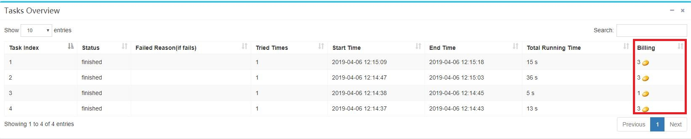
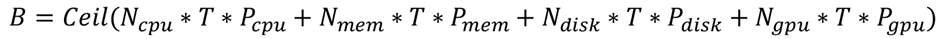

# Billing #

On the **Info** page of each job, you can view the billing for each task, as shown below:：

Billing is performed when each task reaches the termination state (failed, finished, and stopped), and the number of "beans" owned by the user will be deducted. The total cost of a job is a simple accumulation of the cost of the task.

For each running instance of each task on one vnode, the billing formula is:

Among them, B is the number of beans spent, Ceil means taking the ceiling, Ncpu is the number of CPU cores configured by the task, Nmem and Ndisk are the memory size and disk size (in GB) configured by the task respectively, and Ngpu is the number of configured gpus, and T is the total running time of the task (in seconds). Pcpu, Pmem, Pdisk, and Pgpu are the prices of each resource.

In current version，the prices are：

* Pcpu = 1/3600 /(core*s)
* Pmem = 1/3600 /(GB*s)
* Pdisk = 1/3600 /(GB*s)
* Pgpu = 100/3600 /(num*s)

The cost of a single task is the cumulative cost of an running instance on each vnode.