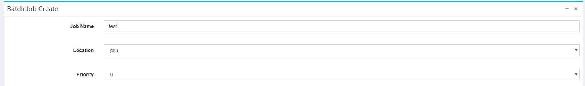
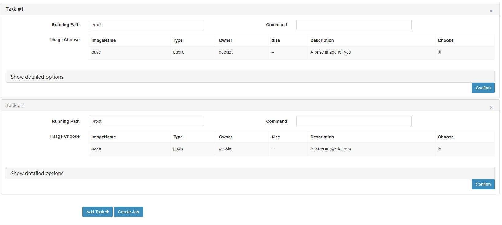
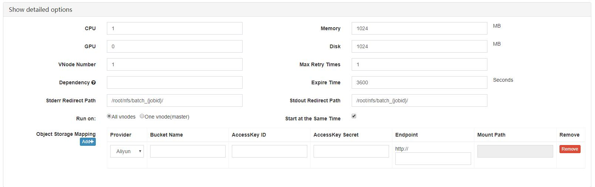

# Batch Jobs Creation and Configuration #

On the job creation page, the first three fields are the job name, the cluster location that jobs are submitted to and the priority:
 

Note：

* The name does not need to be unique. It is recommended to take a name that describes the job information.
* The cluster location is the cluster location where the job is actually executed. Image and data between clusters cannot be shared.
* The priority is the priority of the scheduling, 0 is the lowest priority, and 9 is the highest. The higher the priority, the more possible the job will be executed.

After that is configuration form of each task:

In each form of the task, click **"x"** in the upper right to delete the task and click **Confirm** in the bottom right to fold this panel.

Click **Add Task** at the bottom to add a new task. There is only one task by default.

The first three configurations of the task are: Running Path, Command and Image.

The rest of the configuration needs to be clicked **Show detailed options**:

Note：

* CPU: The number of CPU cores used by each vnode.
* GPU： The number of GPUs used by each vnode.
* Memory： The amount of memory used by each vnode.
* Disk： The disk size used by each vnode.
* Vnode Number: The number of vnodes that the task is running on.
* Max Retry Times: how many times a task will retry at most when being encountered with error run by each vnode.
* Expire Time: The timeout period of the task running on each virtual node, the task exceeding the time will be killed by the system.
* Dependency: Dependent tasks. Fill in the task number on which the task depends, separated by commas, such as: 1, 2. The task number appears after "**#**" in each task title. This task will be executed after the dependent task is completed.
* Stderr/Stdout Redirect Path： Includes redirection of stderr and stdout. If ending with "/", the file named "{taskid}_{vnodeid}_stdout/stderr.txt" will be output to the folder, otherwise it will be output to the named file. The path needs to exist.
* Run on: "All vnodes" runs the same command on each vnode, and "One vnode(master)" runs only on the node with the host name batch-0.
* Start at the Same Time: Whether the tasks on each vnode need to be started at the same time.
* Object Storage Mapping: System support object storage service from external cloud providers. And can mount the bucket into the vnode. Needs to fill the form. Currently only supports Aliyun.

**Other default configuration**：All vnodes of a task are in a local area network, and their host names are batch-0, batch-1 in order of startup. In addition, each vnode is open for ssh secret-free login, and both can access the external network.