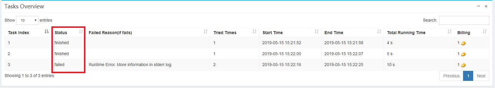

# Job Statuses and Scheduling #

The statuses of the tasks in the job can be viewed through the **Info** button on the Batch index page:

The kinds of statuses of a task are shown as follows:

* pending: The task has not yet entered the scheduling queue.
* scheduling: The task is in the scheduling queue and waiting for scheduling.
* running: The task is being executed.
* retrying: An error has occurred and is about to be retried.
* failed: The task has failed and will not be executed again.
* finished: The task has completed successfully.
* stopped: The mission was stopped artificially.

The status of the job is affected by the state of the task, which can be changed as follows:

* failed: At least one task failed.
* finished: All tasks are finished.
* stopping: The job is stopping.
* stopped: The job has been artificially stopped.
* running: At least one task is being executed.
* pending： others.

In Docklet, a task is the basic unit of scheduling execution. Tasks without dependencies go directly to the scheduling queue, and other tasks will not enter the queue until their dependent tasks are completed.