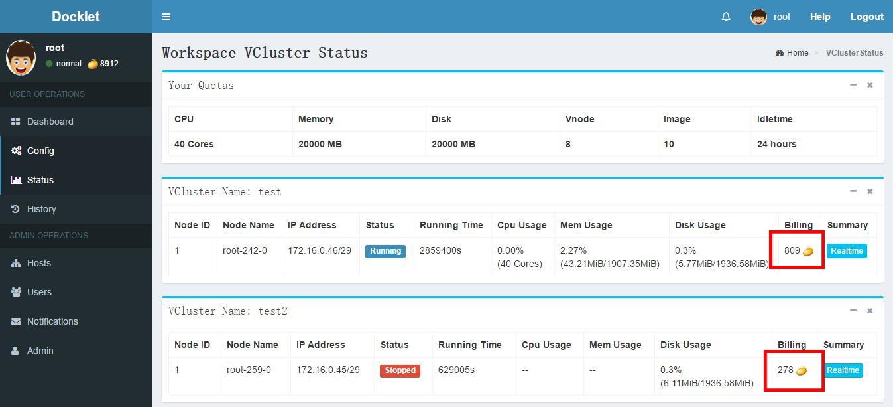
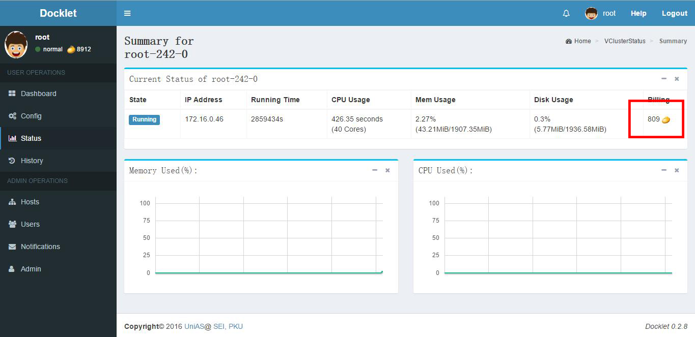

# Billing System #

The billing system will bill user for each vnode **respectively**.
Whenever the **running time** of a vnode reach **an hour** or user **delete the vnode**, system will bill 
user for the resources the vnode has used **from last billing time to now**.
And user's beans will decrease to pay for it. 

The status page dispaly how many beans each node has cost, shown as follows:

Besides, the amount of beans to decrease this hour will be figured out according to the following formula:

 B = [ Tcpu/a + Mave/b + D/c ]

B represents the amount of beans to decrease this hour. Tcpu represents the cpu time the vnode has used 
from last billing time to now. And Mave represents the average Memory the vnode has used per second **multiply 
the cpu time**. And D represents the **disk quota** instead of the used amount of disk. "a", "b" and "c" are 
constant value and "[ ]" means the final value will be top integral, which means the beans cost this hour 
will at least be 1.

At present, a = 500s, b = 1000000MB, c = 4GB

When your beans are equal to or less than 0, **all your vclusters(workspaces) will be stopped**.
And you **can not create, start and scale out(add node) any workspace**.
