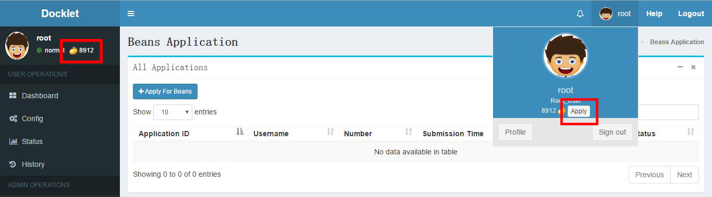

# How to get beans #

At present, you can click the beans icon or the "apply" button to the application page,
 shown as follow:

And on this page, you can apply for beans or query your applications before.
As for applications, you should fill the blank with the amount of beans you 
are going to apply and the reason about how you will use your workspaces. The 
applications will be processed **in an hour**.
