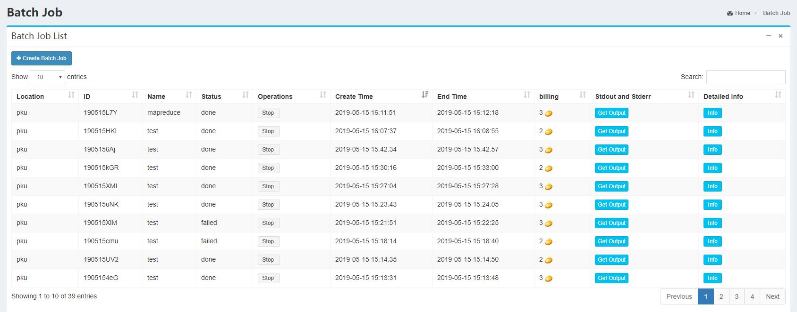
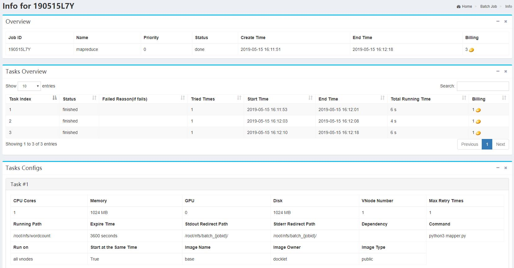
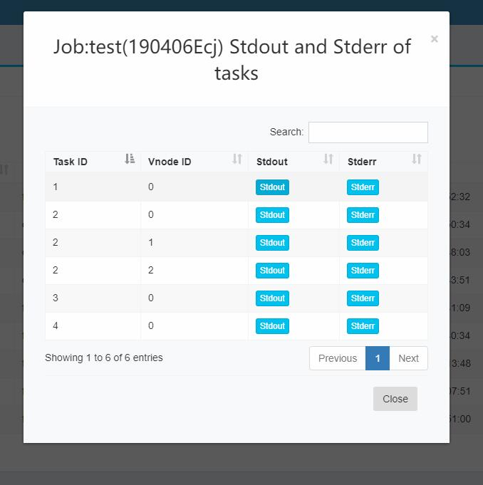
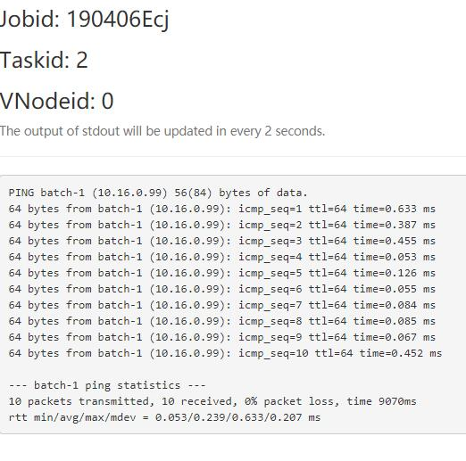

### Batch ###

BatchCompute is a distributed cloud service for parallel batch jobs. It can support batch jobs with directed acyclic graphs(DAG). Batch computing system will automatically completes resource management, job scheduling and data loading, and charges according to actual usage.

The batch page focuses on the main information for all batch jobs submitted by users:

This page mainly supports the following operations:

1.Cick **Info** ，you will see the detailed information of batch jobs, including the statuses and detailed configurations of tasks of a job, shown as follows:

2.Click **Get Output**, can fetch outputs of stderr and stdout of all the tasks running on each vnode:

And click one button of them can show the output of stdout or stderr of the task running on the vnode:

**Note**：The page is updated automatically every 2 seconds and only shows the output of the last 100 lines.

3. Click **stop** can stop the running jobs. If you find jobs wrong configuration, please stop it in time for resources saving.

4. Click **Create Batch Job** will create a new batch job. More information in [Batch jobs creation and configuration](../batch/create.md).

More introduction on batch computing, please look up in [Batch Computing](../batch/README.md).
