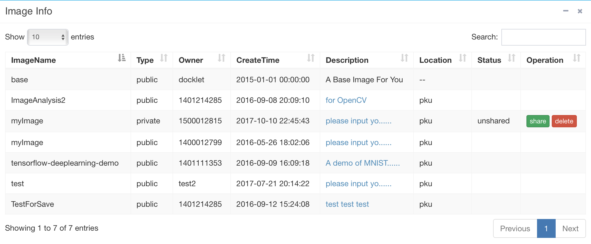

## Config ##

Users will configure their Workspace here, mainly the management of
vclusters and images.

The following picture shows the Config webpage of **tee** Workspace:

Users can add nodes to or remove nodes from the vcluster. The above
picture show the *tee* Workspace having two nodes, with the detailed
information about node's name, IP address, status and image created
from, etc.

Click **Save** to save the Workspace as a image named *myimage*, which
can be used later on. Now the image list is shown as:

Users can also **Share** their saved private images with others, to help
them avoid tedious installation and configuration stuff.
