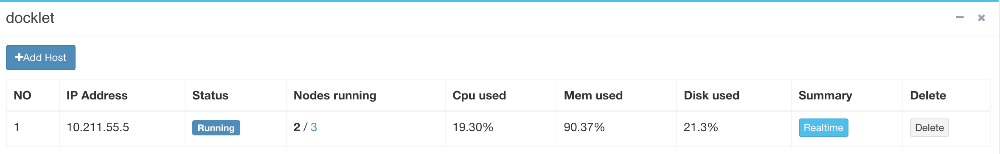

## Hosts ##

This webpage requires *admin* role to access.

The Hosts webpage shows the status of the Docklet physical cluster,
including host IP address, status, containers hosted, resource
usage, etc.

The following show the information of a demo Docklet physical cluster:

Click the host's **Realtime** button, will get the configuration
information of the host: 

Also the host's realtime resource usage activity:

