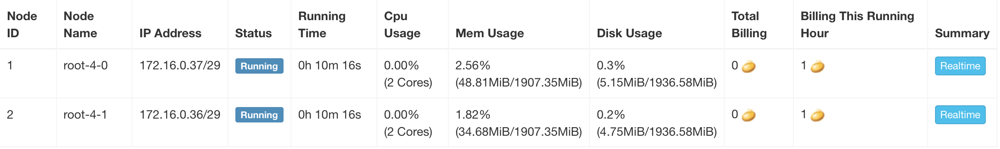
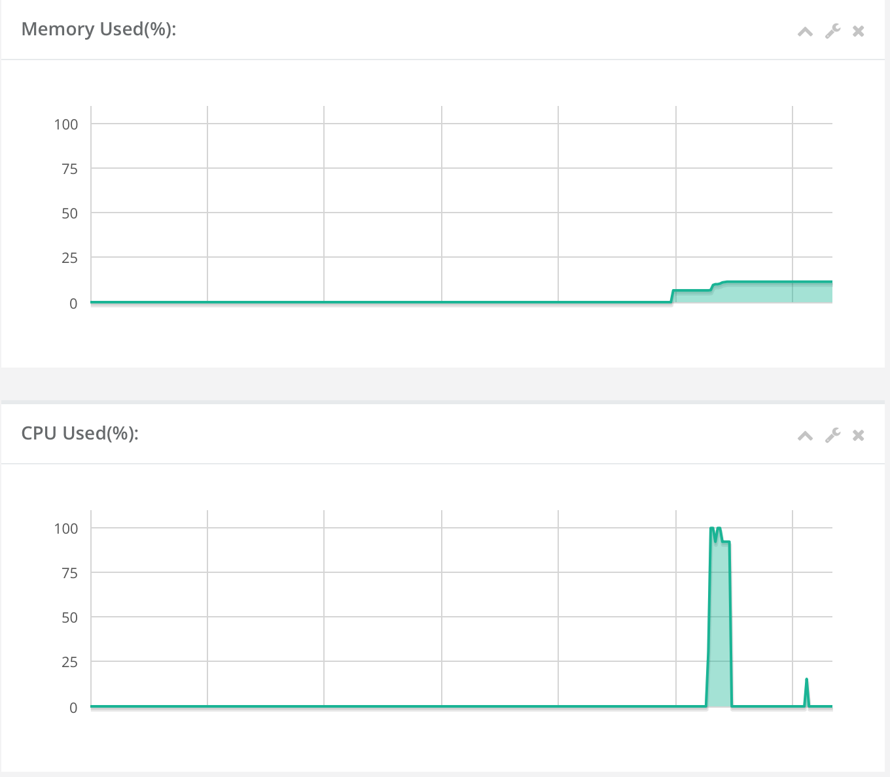

### Status ###

The Status web page shows the vcluster monitoring information. Here users can see the load info of their vclusters, including CPU and memory activity.

The following picture show the general load of the *tee* Workspace
vcluster:

Click **Realtime**, will get the realtime usage of the node's CPU and
memory, shown as follows:

