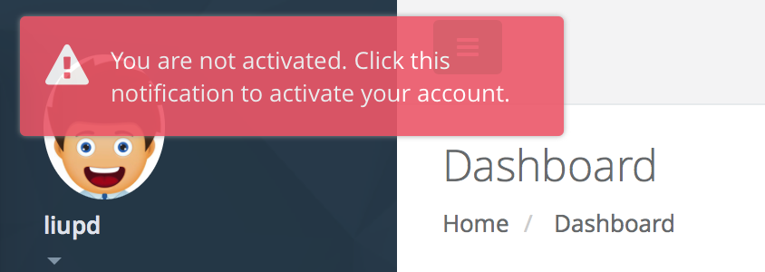

## Users ##

This webpage requires *admin* role to access.
Through it administators can get and modify users' information,
and add user or usergroup at the same time.

### Register & Activating ###
Now docklet account cannot be registered by users, it uses external authenticating system like pam to let users log in.

Docklet account need activating to use some specific functions.When an external account is used at the first time, a notification will be shown in the upper left corner of the webpage, which says you should hand in a request form.

By clicking it, you can enter the activating page. Your E-mail, student/staff ID, department, real name and reason to use Docklet is required.After handing in the request, Docklet administrators will verify it in 3 days.

Your browser will log out Docklet automatically, re-login is required to refresh user info.Before your request is verified, a notification will be shown in upper left corner.It can be closed by clicking.

## Guest Mode ##
Users can try to use docklet in guest mode. Before your account is activated, you can click the 'have a try' link to enter guest mode.

You can enter a workspace through the 'go' button.
