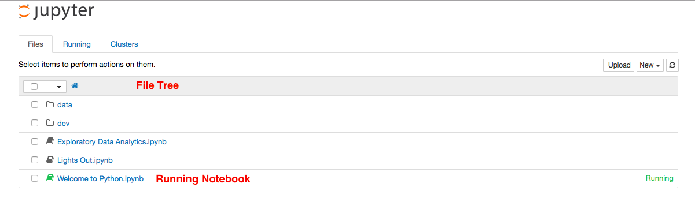

# Workspace #

Docklet Workspace is provided by the integrated open source component of
[Jupyter Notebook](https://github.com/jupyter/notebook).
There are many documents about Jupyter Notebook. Users are recommended
to visit the latest official document 
[The Jupyter notebook](http://jupyter-notebook.readthedocs.org/en/latest/index.html) for help, where the [UI Components](http://jupyter-notebook.readthedocs.org/en/latest/ui_components.html) describes Jupyter Notebook user interface.

The Jupyter Notebook dashboard is the entrance of all operations. A
demo snapshot is depicted as follows:

This section mainly focuses on the following Workspace functions:

* [Data Management](data.md)
* [File Editing](edit.md)
* [WEB Terminal](terminal.md)
* [Interactive Programming](notebook.md)
