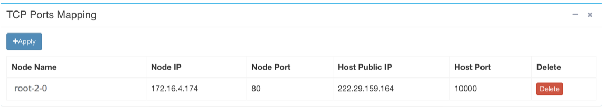

## WEB Terminal ##

To operate in terminal is necessary for many developers. Almost all
system administrator, programming, debugging and analyzing jobs can be
performed in terminal environment.

In the Jupyter Notebook dashboard, click **New** - **Terminal** will create a new WEB Terminal and then enter the terminal, where users can do their stuffs like editing a file using vi, running a program, etc.

The Jupyter Notebook WEB Terminal has one important feature: running in
the background, even users has closed the WEB Terminal webpage. The
user can find all their live Terminals by clicking **Running** -
**Terminals** in the dashboard. They can re-enter the Terminal by
clicking the name, to recover their work. This feature is very important
for long running jobs.

If the user re-enter the Terminal after a long period of idle time, the Terminal
may show no response to user input. Usually refresh the page will get it
back.

If the user will perform multiple tasks, they can open several
Terminals, or using [tmux](https://tmux.github.io) in one Terminal.

**Note**:
Sometimes, in Chrome, the fonts of terminal may be not monospaced. 
This may cause the width of terminal not fixed and commands' output not aligned. 
Here is the way to fix it : Chrome -> Settings -> Appearance -> Custom Fonts, choose a monospaced font for **Monospaced Font**

### Install Software ###

Users can install software packages not in the base image. The Docklet
container is based on Ubuntu. The command `apt-get` is used for package
installation.

Example:

```
$ apt-get install clang
```

Users are encouraged to clean the `apt-get` cache to save disk space

```
$ apt-get clean
```

About `apt-get`, please refer to
the [official help](https://help.ubuntu.com/community/AptGet/Howto).

### Using your local terminal ###

Users sometimes want to access docklet using their favorite local terminal in local computer. Since docklet vnode is behind the firewall, users can not connect to their vnodes directly, but can do so by way of port mapping.

Each Node can apply for multiple ports, but there is a quota limit. The Node port will be mapped to the host port, and the TCP packets sent by the user to the host port will be transferred to this port. The service on the node needs to listen to the configured port.

Users apply for port mapping in config page, and there shows the corresponding port mapping table item:


port 10000 is directly mapped to port 22 of the container. Connecting to the port 10000 of Host Public IP is equivalent to the connection to the container.

Suppose the user has an account in the container named **myname**, execute the following command in your local terminal:

```
ssh -p 10000 myname@masterip
```

masterip corresponds to 222.29.159.164 in the figure above. It may ask for a passphrase for root at the docklet vnode. You can set a passphase in the dockelt vnode using passwd command.

More about **port mapping**, users may refer to relevant information online.
