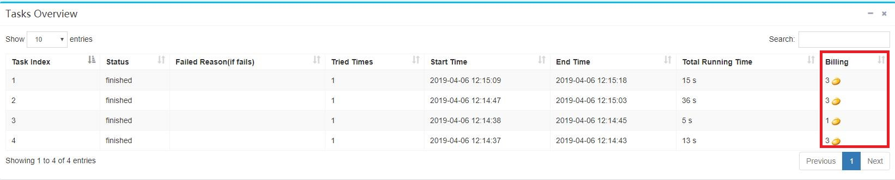
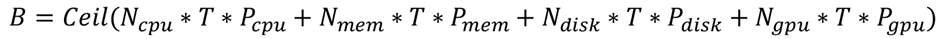

# 如何计费 #

在每个作业的**Info**页面，可以查看到每个任务的计费，如下图所示：

计费会在每个任务到达终止状态(failed、finished和stopped)时进行，并扣除用户拥有的"豆"数。 而一个作业的总花费为任务的花费的简单累加。

对于每个任务在其中一个虚节点的运行实例，其计费公式为：

其中，B为所花费的豆数量，Ceil表示取上取整，Ncpu为任务所配置的CPU核数，Nmem和Ndisk分别为任务所配置的内存大小和磁盘大小（单位为GB），Ngpu为任务所配置的gpu个数，T为任务总的运行时间(单位为秒)。 Pcpu, Pmem, Pdisk, Pgpu分别为各资源的单价。

在当前版本中，各资源单价为：

* Pcpu = 1/3600 /(core*s)
* Pmem = 1/3600 /(GB*s)
* Pdisk = 1/3600 /(GB*s)
* Pgpu = 100/3600 /(num*s)

单个任务的花费为每个虚节点运行实例花费的累加。