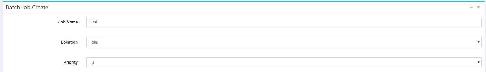
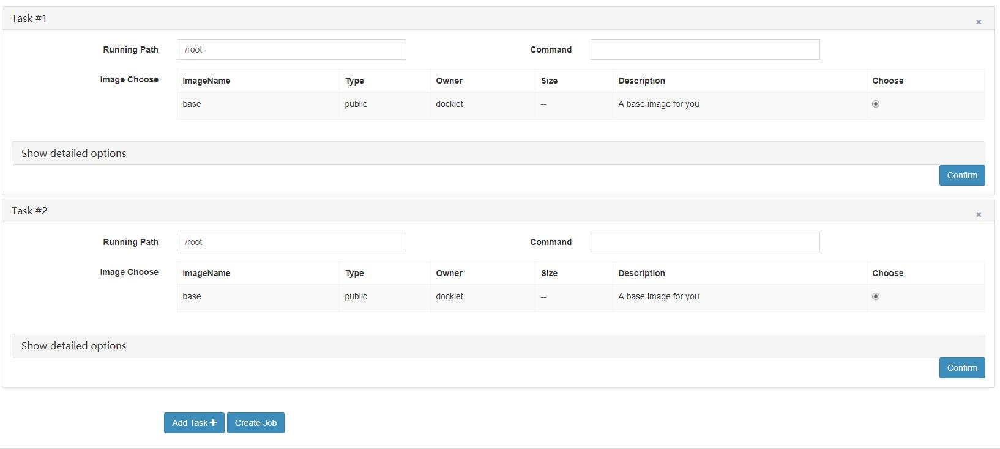
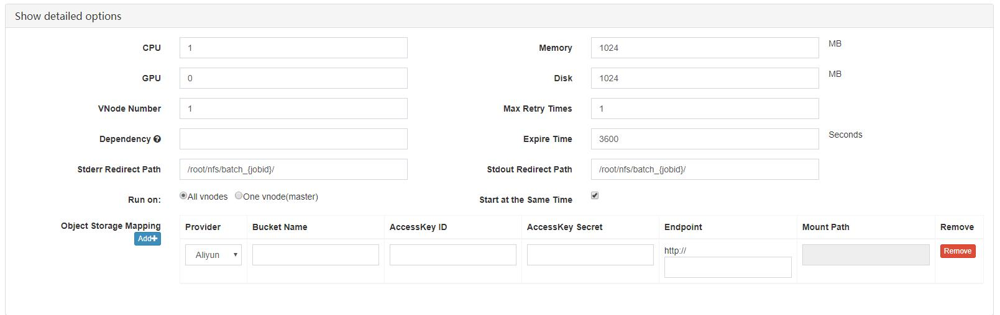

# 作业创建及作业配置 #

在作业的创建页面，最开始的三项是作业的名字、提交的集群位置和优先级。如下图所示：

其中：

* 名字不需要唯一，建议取能够描述作业信息的名字。
* 集群位置为作业实际执行的集群位置，不集群间的镜像和数据不能共享。
* 优先级为调度的优先级，0是最低优先级，9则为最高，优先级越高其任务越优先执行。

之下为各任务的配置表单，如下图所示：

在每个任务配置项中，点右上角的**"x"**可以删除该任务，而点击右下角的**Confirm**可以缩小该任务。

点击底部的**Add Task**可添加新任务，默认情况下只有一个任务。

任务的前三项配置为：工作路径（Running Path）、命令(Command)和镜像(Image)。

其余配置需点击**Show detailed options**，如下图所示：

其中：

* CPU: 每个虚节点使用的CPU核数。
* GPU： 每个虚节点使用的GPU个数。
* Memory： 每个虚节点使用的内存大小。
* Disk： 每个虚节点使用的磁盘大小。
* Vnode Number: 任务所运行的虚节点数量。
* Max Retry Times: 每个虚节点运行的任务的错误重试次数。
* Expire Time: 每个虚节点运行的任务的超时时间，超过时间的任务会被系统杀掉。
* Dependency: 依赖的任务项。填写该任务所依赖的任务编号，以逗号做分隔，如：1,2。 任务编号出现在每个任务标题中的"**#**"后面。该任务会在依赖的任务完成后执行。
* 输出重定向路径： 包括标准输出流和标准错误流的重定向。若以"/"结尾则会将文件名为"{taskid}_{vnodeid}_stdout/stderr.txt"的文件输出到文件夹中，否则输出到命名的文件中。路径需存在。
* Run on: All vnodes为虚节点上每个节点都运行相同的命令，One vnode(master)为只在主机名为batch-0的节点上运行。
* Start at the Same Time: 各虚节点上的任务是否需要同时启动。
* Object Storage Mapping: 系统支持挂载外部云的对象存储的bucket，按照表单要求填写信息即可。目前仅支持阿里云。

**其他默认配置**：一个任务的所有vnode处于一个局域网，并且其主机名按启动顺序依次为batch-0、batch-1...此外，每个vnode间开放ssh免密登录，且都可以访问外部网络。