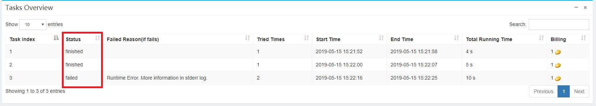

# 作业状态及调度 #

作业中的任务状态可以通过Batch首页的**Info**按钮查看，如下图所示：

任务的状态有以下几种：

* pending: 任务还没进入调度队列。
* scheduling: 任务正在调度队列排队，等待调度。
* running: 任务正在执行。
* retrying: 发生了错误正准备重试。
* failed: 任务已经失败并不会再执行。
* finished: 任务已成功完成。
* stopped: 任务被人为停止。

而作业的状态受到任务的状态影响会发生变化，有以下几种：

* failed: 有至少一个任务失败。
* finished: 所有任务都完成。
* stopping: 作业正在停止。
* stopped: 作业已经被人为停止。
* running: 有至少一个任务正在执行。
* pending： 其余的状态都为此阻塞状态。

在Docklet中，任务是调度执行的基本单位。无依赖的任务会直接进入调度队列，而有依赖的任务会等到其依赖任务执行完成才会进入调度队列。