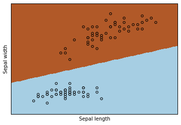

## 使用 Notebook

进入 Dashboard ,  选择 ```New - Python3```, 创建 Python3 Notebook, 会
进入 Python3 Notebook 交互编程环境，并生成一个 ```untitled.ipynb``` 的 
IPython Notebook文件。

本节介绍了一个基本的[Hello World](#hello-world), 一个[机器学习并可视化结
果](#一个机器学习并可视化结果的示例), 一个[完整教程](#完整教程) 的链接。

### Hello World ###

在 Cell 中输入 

```python
print("Hello World")
```

执行后得到输出

```
Hello World
```


### 一个机器学习并可视化结果的示例

绘图需要加载 matplotlib. 在 Cell 中输入并执行

```python
%matplotlib inline
```

或者 

```python
%matplotlib notebook
```

即可开启在浏览器中绘图的支持。

在后面的 Cell 中输入并执行下面关于机器学习的代码

```python
# import package
import numpy as np
import matplotlib.pyplot as plt
from sklearn import linear_model, datasets

# load data : we only use target==0 and target==1 (2 types classify) and feature 0 and feature 2 ()
iris = datasets.load_iris()
X = iris.data[iris.target!=2][:, [0,2]]  
Y = iris.target[iris.target!=2]

h = .02  # step size in the mesh

logreg = linear_model.LogisticRegression(C=1e5)
logreg.fit(X, Y)

# Plot the decision boundary. For that, we will assign a color to each
# point in the mesh [x_min, m_max]x[y_min, y_max].
x_min, x_max = X[:, 0].min() - .5, X[:, 0].max() + .5
y_min, y_max = X[:, 1].min() - .5, X[:, 1].max() + .5
xx, yy = np.meshgrid(np.arange(x_min, x_max, h), np.arange(y_min, y_max, h))
Z = logreg.predict(np.c_[xx.ravel(), yy.ravel()])

# Put the result into a color plot
Z = Z.reshape(xx.shape)
#plt.figure(1, figsize=(4, 3))
plt.pcolormesh(xx, yy, Z, cmap=plt.cm.Paired)
plt.xlabel('Sepal length')
plt.ylabel('Sepal width')

# Plot also the training points
plt.scatter(X[:, 0], X[:, 1], c=Y, edgecolors='k', cmap=plt.cm.Paired)
plt.xlabel('Sepal length')
plt.ylabel('Sepal width')

plt.xlim(xx.min(), xx.max())
plt.ylim(yy.min(), yy.max())
plt.xticks(())
plt.yticks(())

plt.savefig("learn.svg")
```

稍后可看到如下输出



当前目录下同时会生成矢量图形文件 ```learn.svg```，可以在 Dashboard 中打
开， 也可以直接在 Cell 中打开 

```
SVG("learn.svg")
```


### 完整教程 ###

在IPython Notebook中 能做很多事情，如显示本地磁盘中的各种图形文件、视频
文件、HTML文件，加载一个外部网站，显示 LaTeX 公式等，完整介绍和教程请见
[这里](http://nbviewer.jupyter.org/github/ipython/ipython/blob/4.0.x/examples/IPython%20Kernel/Index.ipynb).

[nbviewer](http://nbviewer.jupyter.org) 同样提供了很多其他应用示例。
