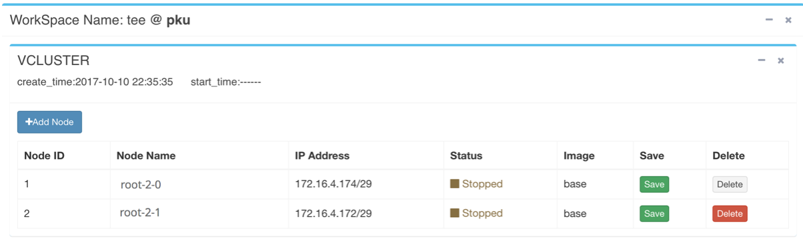
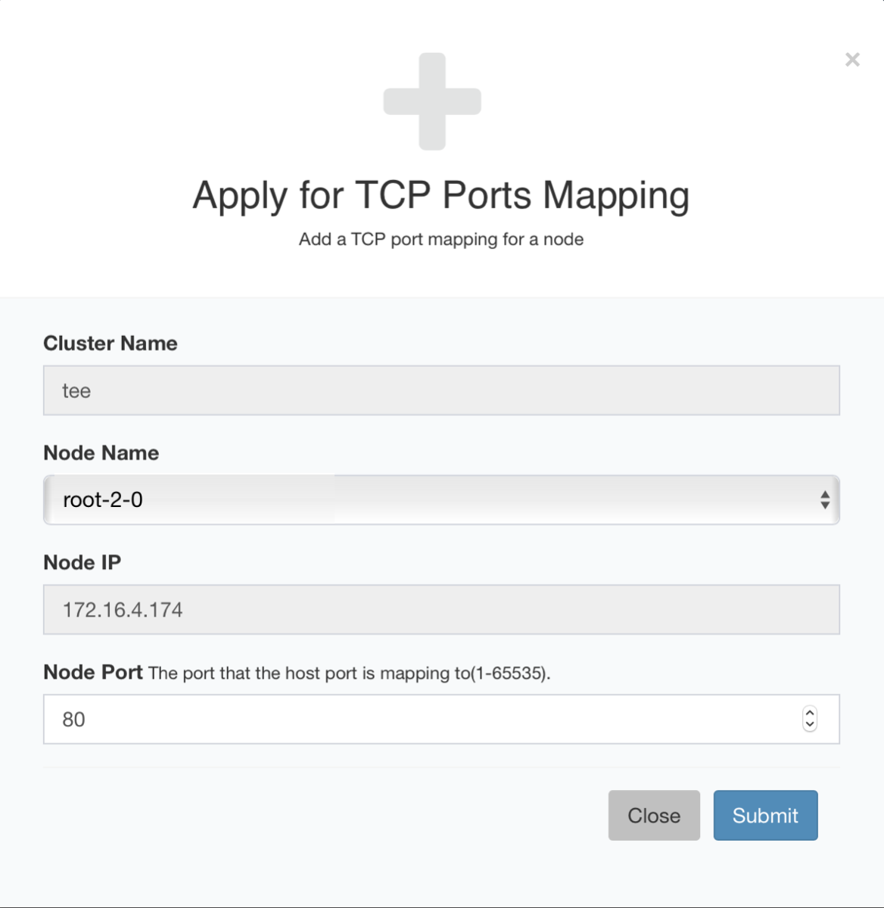

## 配置 ##

配置(Config)是对工作区进行配置操作的界面，
主要是对虚拟集群的节点进行配置，以及对自己的镜像进行管理。

下图显示了 *tee* 工作区的配置页面:

### 伸缩节点

在这里，可以为工作区增加或删除节点。上图显示 *tee* 工作区现在有两个节点，
并显示每个节点的名称、IP地址、状态、镜像信息等。

### 保存镜像

可以点击 **Save** 保存工作区，将其做成一个镜像，名为*myimage*，方便下次使用。
此时的镜像列表信息如下图所示:

可以对保存的镜像进行管理，将其**共享(Share)**出去，造福他人，
免去他们繁琐的配置步骤。

### TCP端口映射

用户的每一个节点都能申请多个TCP端口，但总数有配额限制，设置的节点端口会映射到主机的一个端口，用户向主机端口发送的TCP包都会到转送到这个端口。节点上的服务需要监听配置的端口。

下图显示了 *tee* 工作区的TCP端口映射页面:

可以点击 **Apply** 给节点添加TCP端口映射：

