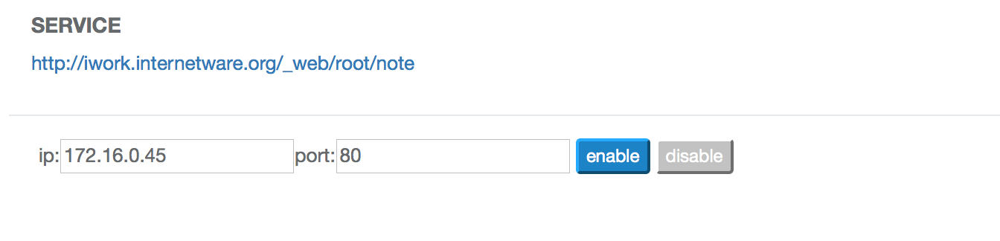

## 配置 ##

配置(Config)是对工作区进行配置操作的界面，
主要是对虚拟集群的节点进行配置，以及对自己的镜像进行管理。

下图显示了 *tee* 工作区的配置页面:


### 伸缩节点

在这里，可以为工作区增加或删除节点。上图显示 *tee* 工作区现在有两个节点，
并显示每个节点的名称、IP地址、状态、镜像信息等。

### 保存镜像

可以点击 **Save** 保存工作区，将其做成一个镜像，名为 *myimage*，方便下次使用。
此时的镜像列表信息如下图所示:


可以对保存的镜像进行管理，将其**共享(Share)**出去，造福他人，
免去他们繁琐的配置步骤。

### 自定义WEB 访问

Docklet为每个vcluster提供了一个URL, 用于从外部访问vcluster内部的
WEB服务。用户可以定义由哪个容器提供该WEB服务。



上面是一个例子，用户 *root* 的 Workspace *note* 有一个公共URL

`http://iwork.internetware.org/_web/root/note`

用户配置该URL由内部IP地址为 `172.16.0.45:80` 的容器提供服务。

如果该容器运行 nginx, 那么可以在nginx的配置文件
`/etc/nginx/site-enabled/default` 中增加下述指令:

```
location /_web/root/test/  {
    proxy_pass http://localhost/ ;
}
```

重启nginx, 

```
$ service nginx restart
```

就可以从外部通过该URL访问位于内部的WEB服务了。

