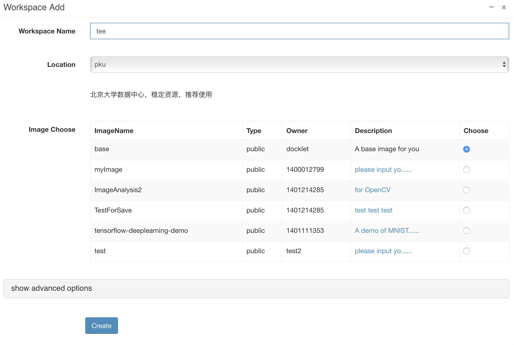
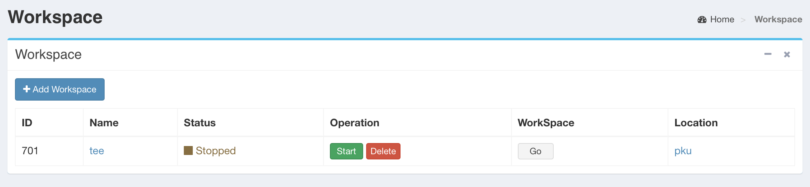

## 面板 ##

面板(Dashboard)是工作区(Workspace)的操作界面，
在这里用户可以看到其拥有的所有workspace的状态，
进行工作区的创建，启动，停止，删除操作，并可以进入工作区。

初始时工作区列表为空，用户需要创建一个工作区。
点击 **Add Workspace**，进入创建工作区的页面，选择镜像，创建工作区
**tee**，如下图所示:



创建成功后，工作区列表如下图所示:



图中显示已经创建了一个名为 *tee* 的工作区，其状态为 **Stopped**。
此时可以进行 **启动(Start)** 和 **删除(Delete)** 工作区的操作。
被停止的 工作区 不会被销毁，下次仍然可以继续使用它。
推荐在不运行作业的时候停止 工作区 以减少服务器负载。

点击 **Start**，启动工作区，工作区状态改变，如下图所示:


此时显示其状态为 **Running**，可进行 **停止(Stop)** 和 **进入(Go)** 
工作区的操作。也可以点击工作区的名字 *tee*，
可以进入工作区的 [配置](config.md) 页面；点击状态**Runnig**，
进入工作区的 [状态](status.md) 页面。

**注意**: 

1. 如果在刚创建之后马上点击 **Go** ，可能会出现`503: Proxy Target
Missing` 错误，这很可能是因为后台尚未初始化完成。
稍后再点击 **Go**，就会正常进入工作区。

1. 如果用户点击 **Go** 时出现 

```
Not Found

The requested URL was not found on the server. If you entered the URL
manually please check your spelling and try again.
```

可能是因为系统因为某种原因重启，用户需要自己重新启动Workspace，然后再进入。
