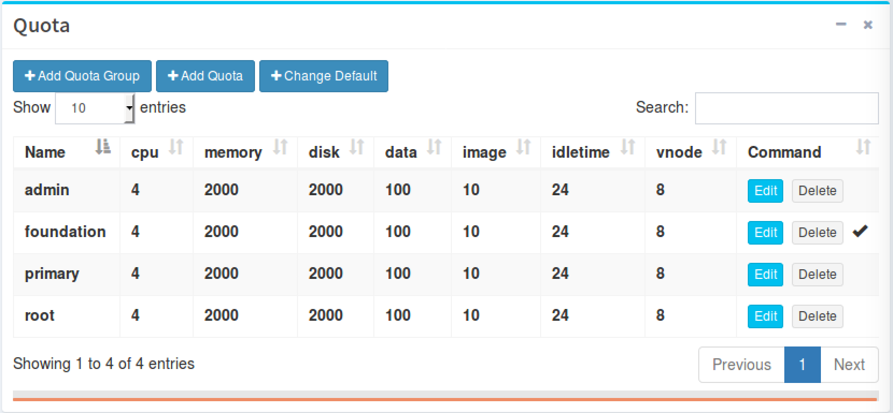
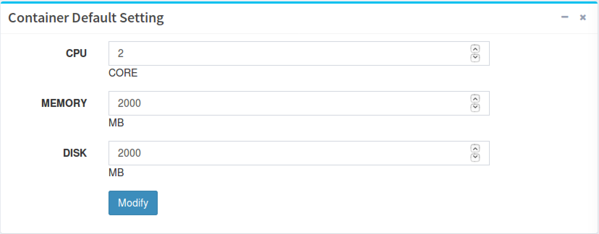
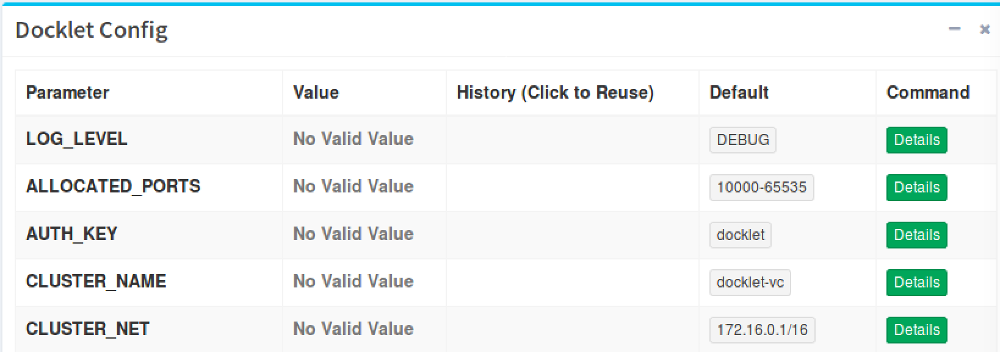
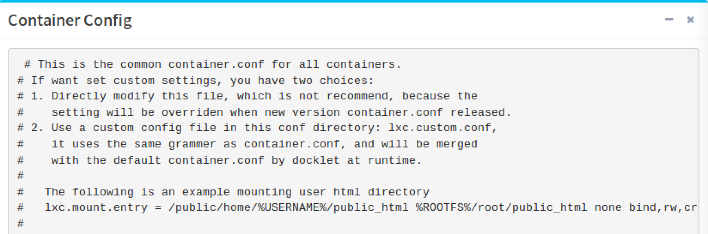

## 设置 ##

设置(Settings)页面仅由具有 **管理员(admin)** 权限的用户访问。
该页面提供对docklet中设置信息展示、修改功能。

### 配额 ###

配额部分显示了用户所有工作区下所有节点的总配额。
在这里，管理员可以查看当前配额信息、添加配额或配额组和改变默认配额组。

下图展示了4条配额信息，可以点击 **Edit**、**Delete** 进行编辑或删除：

### 容器默认设置 ###

管理员可以查看和修改容器的默认设置，即用户申请工作区的默认设置。
包括CPU核心数、内存大小、磁盘大小。

### 修改设置 ###

管理员可以修改基本设置：

- 管理员邮箱地址
- 发送邮件地址
- 是否开放注册
- 是否启动自动审批

### Docklet配置 ###

Docklet的配置信息以及缺省值。

### 容器配置 ###

在这里，管理员可以查看容器配置文档。

