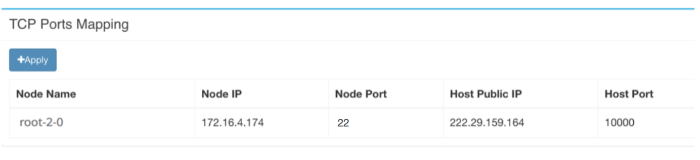

## 终端操作 ##

终端(Terminal) 操作对于很多开发者来说是必需的，
在终端下几乎可以进行所有的系统管理、开发调试、运行分析任务。

在Jupyter Notebook工作面板中，
点击 **New** - **Terminal** 可以创建一个新Terminal并进入其中进行操作，
如调用 vi 编辑文件，运行程序等。

Jupyter Notebook的WEB Terminal有个很重要的特点：可以在后台运行。
即使用户在浏览器中关闭了 Terminal 页面，其仍然在后台运行。
用户可以在 Jupyter Notebook的工作面板 - **Running** - **Terminals**
中找到正在运行的 Terminal ，点击进入其中，恢复工作场景。
这对于长运行的作业很有意义。

如果长时间没有操作 Terminal，可能会出现操作无反应现象，
刷新页面通常即可激活。 

如果要执行多个任务，可以打开多个 Terminal，
也可以在一个 Terminal 中使用 [tmux](https://tmux.github.io) 。

**补充**：
对于 Chrome 浏览器的用户，终端的字体可能不是等宽的，导致终端的宽度
会常常变化，可以通过设置 Chrome 的字体来修复这一问题。具体做法是： Chrome -> 
设置 -> 外观 -> 自定义字体 中，将**宽度固定的字体**修改为某种等宽字体，
比如 Droid Sans Mono.

### 安装软件包 ###

用户可以在WEB Terminal中安装软件包。基础系统是Ubuntu，用户使用 `apt-get`
命令进行安装。

```
$ apt-get install clang
```

如果用户希望未来将工作区保存为镜像，建议清除 `apt-get` 的缓存以减少空间
占用:

```
$ apt-get clean
```

有关`apt-get`，可参阅 
[帮助文档](https://help.ubuntu.com/community/AptGet/Howto)。

### 使用本地终端访问 ###

用户有时希望用本地计算机上的终端访问docklet vnode。由于docklet
vnode 在防火墙后面，因此用户不能直接用自己的计算机访问，可以借助TCP端口映射实现访问。

用户的每一个节点都能申请多个端口，但总数有配额限制。设置的节点端口会映射到主机的一个端口，用户向主机端口发送的TCP包都会到转送到这个端口。节点上的服务需要监听配置的端口。

用户在配置页面添加端口映射，添加后得到相应端口映射表项：


端口10000直接映射到了容器的22端口，与Host Public IP的10000端口连接等价于与容器相连接。


假定用户在容器中有一个账号 **myname**，在终端中执行ssh命令

```
ssh -p 10000 myname@masterip
```

masterip在上图中对应222.29.159.164。此时可能会要求输入密码，该密码是容器中的账号密码。可以用**passwd**命令为root用户设置一个，即可登录。

更多关于 **端口映射** 的技术，可网上咨询相关资料。
